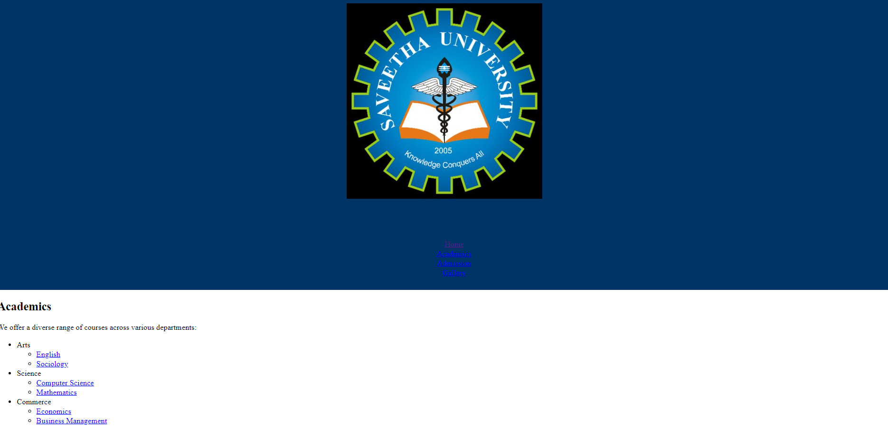
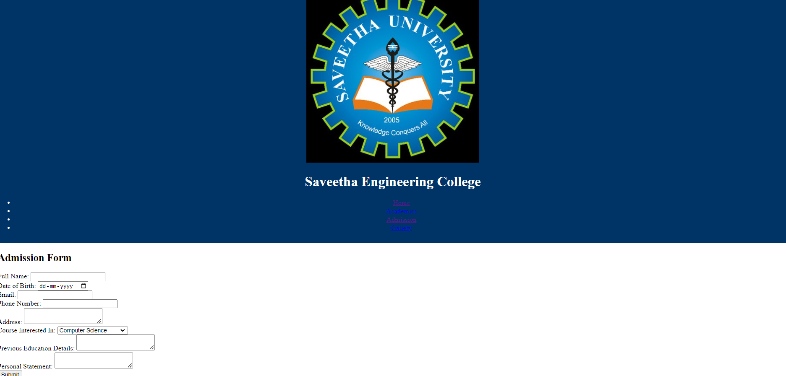
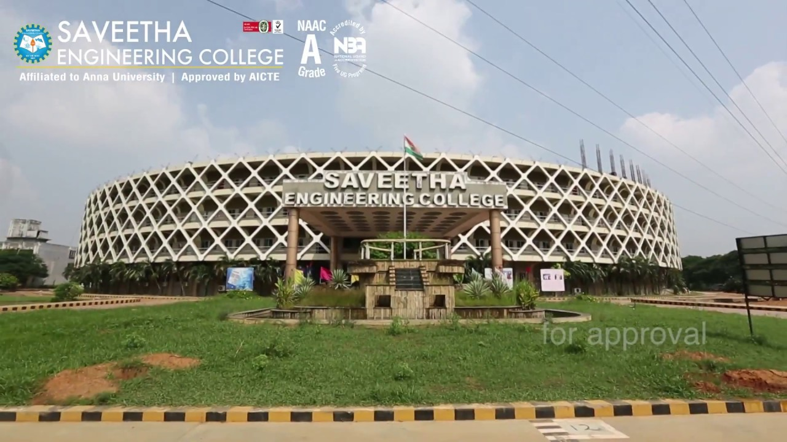
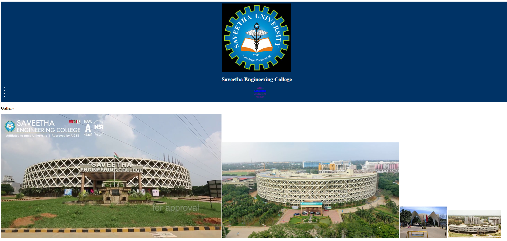
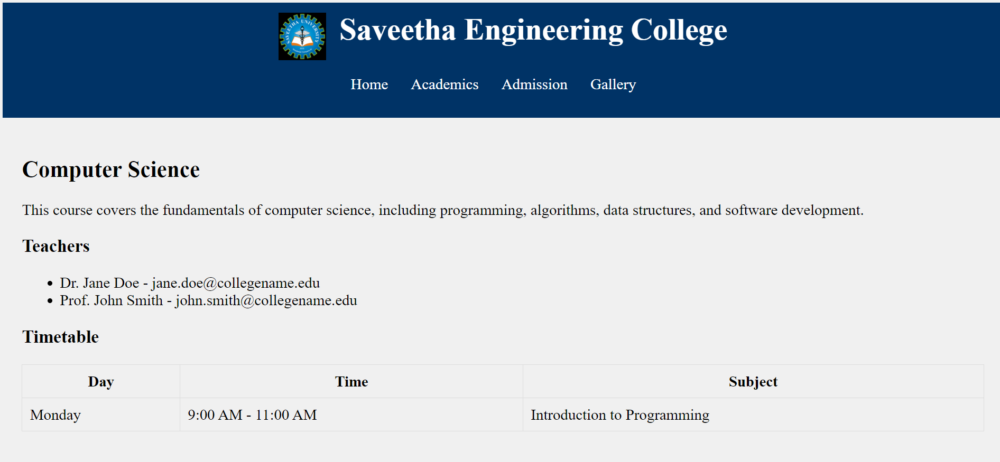
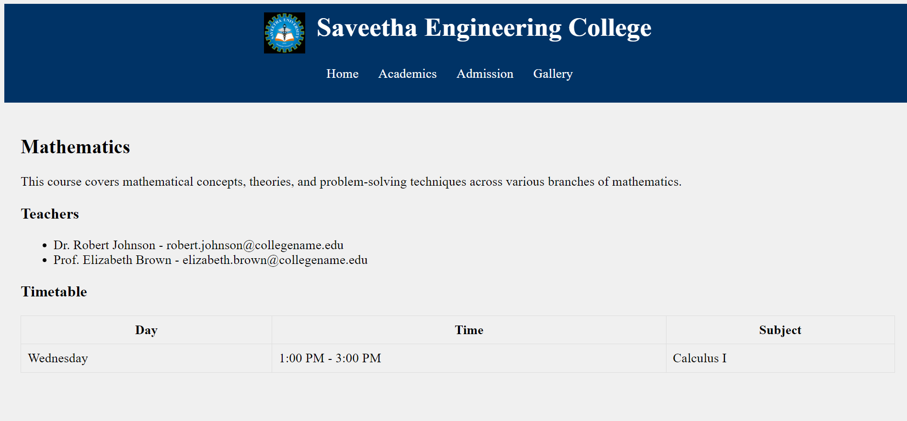
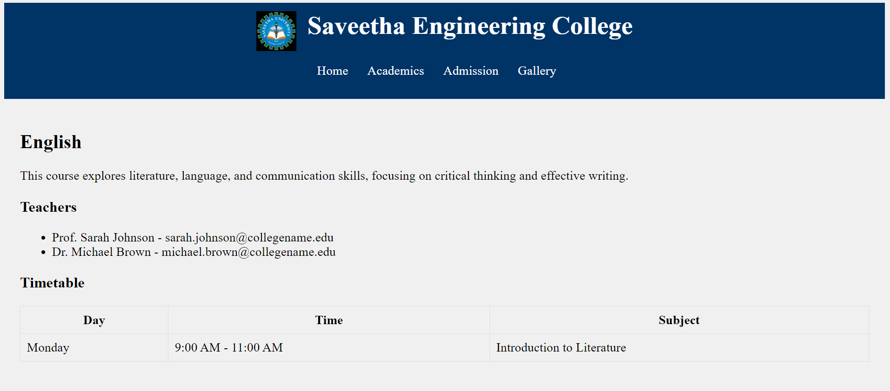
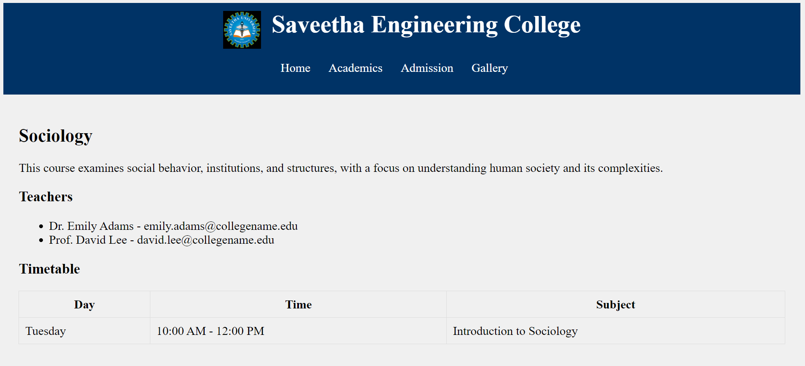
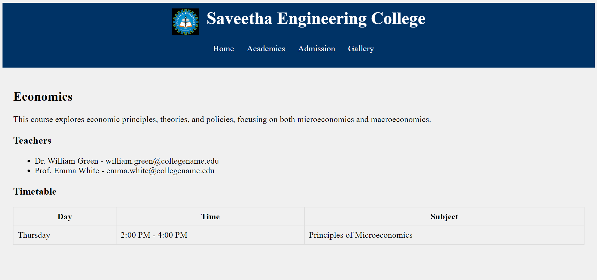
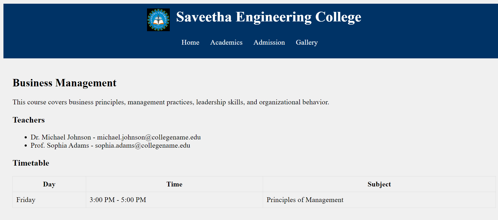

# Design a website for a College..<br/>
## There should be an appropriate description of the college on the home page.<br/>
### One Academics page which contains a list of all the departments present in the college Arts, Science and Commerce. The list should be a nested list, with available courses mentioned under each department. There should be a minimum of two courses under each department, (for e.g. Computer Science and Mathematics under Science, English and Sociology under Arts  and so on). Each Course entry in the list should be a HTML link that leads to a web-page totally dedicated to the course itself.<br/>

### Each Course should have its own dedicated web-page. This page should contain a description about the course, a list of all the teachers taking the course and the timetable for that particular subject.<br/>
### The Admission page basically contains a form that a student needs to fill up in order to take admission in the college. The form should ask all the necessary questions using appropriate form elements.<br/>
### One gallery page that contains set of photos taken of the college and its students.<br/>
### Please note that each web-page in this website should have the same background Image/color. The looks of each page should be similar.<br/>

## index.html:
````
<!DOCTYPE html>
<html lang="en">
<head>
    <meta charset="UTF-8">
    <meta name="viewport" content="width=device-width, initial-scale=1.0">
    <title>College Name</title>
    <link rel="stylesheet" href="style.css">
</head>
<body>
    <header style="background-color: #003366; color: white; padding: 10px 0; text-align: center;">
        
        <h1>College Name</h1>
        <nav>
            <ul>
                <li><a href="index.html">Home</a></li>
                <li><a href="academics.html">Academics</a></li>
                <li><a href="admission.html">Admission</a></li>
                <li><a href="gallery.html">Gallery</a></li>
            </ul>
        </nav>
    </header>
    <main>
        <h2>Welcome to Saveetha Engineering College</h2>
        <p>Saveetha Engineering College (SEC) has always been a favourite destination of recruitment for over 230+ Multinational companies and firms. Our focus on placement centers on creating new approaches to attract the best from the industry to our campus.</p>
    </main>
</body>
</html>
````

## Output:


## academics.html:
````
<!DOCTYPE html>
<html lang="en">
<head>
    <meta charset="UTF-8">
    <meta name="viewport" content="width=device-width, initial-scale=1.0">
    <title>Academics - Saveetha Engineering College</title>
    <link rel="stylesheet" href="style.css">
</head>
<body>
    <header style="background-color: #003366; color: #003366; padding: 10px 0; text-align: center;">
        
        <h1>c</h1>
        <nav>
            <ul>
                <li><a href="index.html">Home</a></li>
                <li><a href="academics.html">Academics</a></li>
                <li><a href="admission.html">Admission</a></li>
                <li><a href="gallery.html">Gallery</a></li>
            </ul>
        </nav>
    </header>
    <main>
        <h2>Academics</h2>
        <p>We offer a diverse range of courses across various departments:</p>
        <ul>
            <li>Arts
                <ul>
                    <li><a href="../courses/english.html">English</a></li>
                    <li><a href="../courses/sociology.html">Sociology</a></li>
                </ul>
            </li>
            <li>Science
                <ul>
                    <li><a href="../courses/computer-science.html">Computer Science</a></li>
                    <li><a href="../courses/mathematics.html">Mathematics</a></li>
                </ul>
            </li>
            <li>Commerce
                <ul>
                    <li><a href="../courses/economics.html">Economics</a></li>
                    <li><a href="../courses/business-management.html">Business Management</a></li>
                </ul>
            </li>
        </ul>
    </main>
</body>
</html>
````

## Output:


#  admission.html
````
<!DOCTYPE html>
<html lang="en">
<head>
    <meta charset="UTF-8">
    <meta name="viewport" content="width=device-width, initial-scale=1.0">
    <title>Admission - Saveetha Engineering College</title>
    <link rel="stylesheet" href="style.css">
</head>
<body>
    <header style="background-color: #003366; color: white; padding: 10px 0; text-align: center;">
        
        <h1>Saveetha Engineering College</h1>
        <nav>
            <ul>
                <li><a href="index.html">Home</a></li>
                <li><a href="academics.html">Academics</a></li>
                <li><a href="admission.html">Admission</a></li>
                <li><a href="gallery.html">Gallery</a></li>
            </ul>
        </nav>
    </header>
    <main>
        <h2>Admission Form</h2>
        <form action="#" method="post">
            <label for="fullname">Full Name:</label>
            <input type="text" id="fullname" name="fullname" required><br>

            <label for="dob">Date of Birth:</label>
            <input type="date" id="dob" name="dob" required><br>

            <label for="email">Email:</label>
            <input type="email" id="email" name="email" required><br>

            <label for="phone">Phone Number:</label>
            <input type="tel" id="phone" name="phone" required><br>

            <label for="address">Address:</label>
            <textarea id="address" name="address" required></textarea><br>

            <label for="course">Course Interested In:</label>
            <select id="course" name="course" required>
                <option value="computer-science">Computer Science</option>
                <option value="mathematics">Mathematics</option>
                <option value="english">English</option>
                <option value="sociology">Sociology</option>
                <option value="economics">Economics</option>
                <option value="business-management">Business Management</option>
            </select><br>

            <label for="education">Previous Education Details:</label>
            <textarea id="education" name="education" required></textarea><br>

            <label for="statement">Personal Statement:</label>
            <textarea id="statement" name="statement" required></textarea><br>

            <input type="submit" value="Submit">
        </form>
    </main>
</body>
</html>
````

## Output :


# gallery.html:
````
<!DOCTYPE html>
<html lang="en">
<head>
    <meta charset="UTF-8">
    <meta name="viewport" content="width=device-width, initial-scale=1.0">
    <title>Gallery - Saveetha Engineering College</title>
    <link rel="stylesheet" href="style.css">
</head>
<body>
    <header style="background-color: #003366; color: white; padding: 10px 0; text-align: center;">
        
        <h1>Saveetha Engineering College</h1>
        <nav>
            <ul>
                <li><a href="index.html">Home</a></li>
                <li><a href="academics.html">Academics</a></li>
                <li><a href="admission.html">Admission</a></li>
                <li><a href="gallery.html">Gallery</a></li>
            </ul>
        </nav>
    </header>
    <main>
        <h2>Gallery</h2>
        <div class="gallery">
            
            
            
            
        </div>
    </main>
</body>
</html>
````

## Output :


# Courses 
# computer-science.html:
````
<!DOCTYPE html>
<html lang="en">
<head>
    <meta charset="UTF-8">
    <meta name="viewport" content="width=device-width, initial-scale=1.0">
    <title>Computer Science - Saveetha Engineering College</title>
</head>
<body style="background-color: #f0f0f0;">
    <header style="background-color: #003366; color: white; padding: 10px 0; text-align: center;">
        
        <h1 style="display: inline; margin-left: 10px;">Saveetha Engineering College</h1>
        <nav>
            <ul style="list-style-type: none; padding: 0;">
                <li style="display: inline; margin-right: 20px;"><a href="index.html" style="color: white; text-decoration: none;">Home</a></li>
                <li style="display: inline; margin-right: 20px;"><a href="academics.html" style="color: white; text-decoration: none;">Academics</a></li>
                <li style="display: inline; margin-right: 20px;"><a href="admission.html" style="color: white; text-decoration: none;">Admission</a></li>
                <li style="display: inline; margin-right: 20px;"><a href="gallery.html" style="color: white; text-decoration: none;">Gallery</a></li>
            </ul>
        </nav>
    </header>
    <main style="padding: 20px;">
        <h2>Computer Science</h2>
        <p>This course covers the fundamentals of computer science, including programming, algorithms, data structures, and software development.</p>
        <h3>Teachers</h3>
        <ul>
            <li>Dr. Jane Doe - jane.doe@collegename.edu</li>
            <li>Prof. John Smith - john.smith@collegename.edu</li>
        </ul>
        <h3>Timetable</h3>
        <table style="width: 100%; border-collapse: collapse;">
            <tr>
                <th style="border: 1px solid #ddd; padding: 8px;">Day</th>
                <th style="border: 1px solid #ddd; padding: 8px;">Time</th>
                <th style="border: 1px solid #ddd; padding: 8px;">Subject</th>
            </tr>
            <tr>
                <td style="border: 1px solid #ddd; padding: 8px;">Monday</td>
                <td style="border: 1px solid #ddd; padding: 8px;">9:00 AM - 11:00 AM</td>
                <td style="border: 1px solid #ddd; padding: 8px;">Introduction to Programming</td>
            </tr>
        </table>
    </main>
</body>
</html>
````

## Output :


# mathematics.html :
````
<!DOCTYPE html>
<html lang="en">
<head>
    <meta charset="UTF-8">
    <meta name="viewport" content="width=device-width, initial-scale=1.0">
    <title>Mathematics - Saveetha Engineering College</title>
</head>
<body style="background-color: #f0f0f0;">
    <header style="background-color: #003366; color: white; padding: 10px 0; text-align: center;">
        
        <h1 style="display: inline; margin-left: 10px;">Saveetha Engineering College</h1>
        <nav>
            <ul style="list-style-type: none; padding: 0;">
                <li style="display: inline; margin-right: 20px;"><a href="index.html" style="color: white; text-decoration: none;">Home</a></li>
                <li style="display: inline; margin-right: 20px;"><a href="academics.html" style="color: white; text-decoration: none;">Academics</a></li>
                <li style="display: inline; margin-right: 20px;"><a href="admission.html" style="color: white; text-decoration: none;">Admission</a></li>
                <li style="display: inline; margin-right: 20px;"><a href="gallery.html" style="color: white; text-decoration: none;">Gallery</a></li>
            </ul>
        </nav>
    </header>
    <main style="padding: 20px;">
        <h2>Mathematics</h2>
        <p>This course covers mathematical concepts, theories, and problem-solving techniques across various branches of mathematics.</p>
        <h3>Teachers</h3>
        <ul>
            <li>Dr. Robert Johnson - robert.johnson@collegename.edu</li>
            <li>Prof. Elizabeth Brown - elizabeth.brown@collegename.edu</li>
        </ul>
        <h3>Timetable</h3>
        <table style="width: 100%; border-collapse: collapse;">
            <tr>
                <th style="border: 1px solid #ddd; padding: 8px;">Day</th>
                <th style="border: 1px solid #ddd; padding: 8px;">Time</th>
                <th style="border: 1px solid #ddd; padding: 8px;">Subject</th>
            </tr>
            <tr>
                <td style="border: 1px solid #ddd; padding: 8px;">Wednesday</td>
                <td style="border: 1px solid #ddd; padding: 8px;">1:00 PM - 3:00 PM</td>
                <td style="border: 1px solid #ddd; padding: 8px;">Calculus I</td>
            </tr>
        </table>
    </main>
</body>
</html>
````

## Output:


#  english.html :
````

<!DOCTYPE html>
<html lang="en">
<head>
    <meta charset="UTF-8">
    <meta name="viewport" content="width=device-width, initial-scale=1.0">
    <title>English - Saveetha Engineering College</title>
</head>
<body style="background-color: #f0f0f0;">
    <header style="background-color: #003366; color: white; padding: 10px 0; text-align: center;">
        
        <h1 style="display: inline; margin-left: 10px;">Saveetha Engineering College</h1>
        <nav>
            <ul style="list-style-type: none; padding: 0;">
                <li style="display: inline; margin-right: 20px;"><a href="index.html" style="color: white; text-decoration: none;">Home</a></li>
                <li style="display: inline; margin-right: 20px;"><a href="academics.html" style="color: white; text-decoration: none;">Academics</a></li>
                <li style="display: inline; margin-right: 20px;"><a href="admission.html" style="color: white; text-decoration: none;">Admission</a></li>
                <li style="display: inline; margin-right: 20px;"><a href="gallery.html" style="color: white; text-decoration: none;">Gallery</a></li>
            </ul>
        </nav>
    </header>
    <main style="padding: 20px;">
        <h2>English</h2>
        <p>This course explores literature, language, and communication skills, focusing on critical thinking and effective writing.</p>
        <h3>Teachers</h3>
        <ul>
            <li>Prof. Sarah Johnson - sarah.johnson@collegename.edu</li>
            <li>Dr. Michael Brown - michael.brown@collegename.edu</li>
        </ul>
        <h3>Timetable</h3>
        <table style="width: 100%; border-collapse: collapse;">
            <tr>
                <th style="border: 1px solid #ddd; padding: 8px;">Day</th>
                <th style="border: 1px solid #ddd; padding: 8px;">Time</th>
                <th style="border: 1px solid #ddd; padding: 8px;">Subject</th>
            </tr>
            <tr>
                <td style="border: 1px solid #ddd; padding: 8px;">Monday</td>
                <td style="border: 1px solid #ddd; padding: 8px;">9:00 AM - 11:00 AM</td>
                <td style="border: 1px solid #ddd; padding: 8px;">Introduction to Literature</td>
            </tr>
        </table>
    </main>
</body>
</html>
````

## Output:


# sociology.html:
````
<!DOCTYPE html>
<html lang="en">
<head>
    <meta charset="UTF-8">
    <meta name="viewport" content="width=device-width, initial-scale=1.0">
    <title>Sociology - Saveetha Engineering College</title>
</head>
<body style="background-color: #f0f0f0;">
    <header style="background-color: #003366; color: white; padding: 10px 0; text-align: center;">
        
        <h1 style="display: inline; margin-left: 10px;">Saveetha Engineering College</h1>
        <nav>
            <ul style="list-style-type: none; padding: 0;">
                <li style="display: inline; margin-right: 20px;"><a href="index.html" style="color: white; text-decoration: none;">Home</a></li>
                <li style="display: inline; margin-right: 20px;"><a href="academics.html" style="color: white; text-decoration: none;">Academics</a></li>
                <li style="display: inline; margin-right: 20px;"><a href="admission.html" style="color: white; text-decoration: none;">Admission</a></li>
                <li style="display: inline; margin-right: 20px;"><a href="gallery.html" style="color: white; text-decoration: none;">Gallery</a></li>
            </ul>
        </nav>
    </header>
    <main style="padding: 20px;">
        <h2>Sociology</h2>
        <p>This course examines social behavior, institutions, and structures, with a focus on understanding human society and its complexities.</p>
        <h3>Teachers</h3>
        <ul>
            <li>Dr. Emily Adams - emily.adams@collegename.edu</li>
            <li>Prof. David Lee - david.lee@collegename.edu</li>
        </ul>
        <h3>Timetable</h3>
        <table style="width: 100%; border-collapse: collapse;">
            <tr>
                <th style="border: 1px solid #ddd; padding: 8px;">Day</th>
                <th style="border: 1px solid #ddd; padding: 8px;">Time</th>
                <th style="border: 1px solid #ddd; padding: 8px;">Subject</th>
            </tr>
            <tr>
                <td style="border: 1px solid #ddd; padding: 8px;">Tuesday</td>
                <td style="border: 1px solid #ddd; padding: 8px;">10:00 AM - 12:00 PM</td>
                <td style="border: 1px solid #ddd; padding: 8px;">Introduction to Sociology</td>
            </tr>
        </table>
    </main>
</body>
</html>
````

## Output :


# economics.html :
````

<!DOCTYPE html>
<html lang="en">
<head>
    <meta charset="UTF-8">
    <meta name="viewport" content="width=device-width, initial-scale=1.0">
    <title>Economics - Saveetha Engineering College</title>
</head>
<body style="background-color: #f0f0f0;">
    <header style="background-color: #003366; color: white; padding: 10px 0; text-align: center;">
        
        <h1 style="display: inline; margin-left: 10px;">Saveetha Engineering College</h1>
        <nav>
            <ul style="list-style-type: none; padding: 0;">
                <li style="display: inline; margin-right: 20px;"><a href="index.html" style="color: white; text-decoration: none;">Home</a></li>
                <li style="display: inline; margin-right: 20px;"><a href="academics.html" style="color: white; text-decoration: none;">Academics</a></li>
                <li style="display: inline; margin-right: 20px;"><a href="admission.html" style="color: white; text-decoration: none;">Admission</a></li>
                <li style="display: inline; margin-right: 20px;"><a href="gallery.html" style="color: white; text-decoration: none;">Gallery</a></li>
            </ul>
        </nav>
    </header>
    <main style="padding: 20px;">
        <h2>Economics</h2>
        <p>This course explores economic principles, theories, and policies, focusing on both microeconomics and macroeconomics.</p>
        <h3>Teachers</h3>
        <ul>
            <li>Dr. William Green - william.green@collegename.edu</li>
            <li>Prof. Emma White - emma.white@collegename.edu</li>
        </ul>
        <h3>Timetable</h3>
        <table style="width: 100%; border-collapse: collapse;">
            <tr>
                <th style="border: 1px solid #ddd; padding: 8px;">Day</th>
                <th style="border: 1px solid #ddd; padding: 8px;">Time</th>
                <th style="border: 1px solid #ddd; padding: 8px;">Subject</th>
            </tr>
            <tr>
                <td style="border: 1px solid #ddd; padding: 8px;">Thursday</td>
                <td style="border: 1px solid #ddd; padding: 8px;">2:00 PM - 4:00 PM</td>
                <td style="border: 1px solid #ddd; padding: 8px;">Principles of Microeconomics</td>
            </tr>
        </table>
    </main>
</body>
</html>
````

## Output :



# business-management.html :
````
<!DOCTYPE html>
<html lang="en">
<head>
    <meta charset="UTF-8">
    <meta name="viewport" content="width=device-width, initial-scale=1.0">
    <title>Business Management - Saveetha Engineering College</title>
</head>
<body style="background-color: #f0f0f0;">
    <header style="background-color: #003366; color: white; padding: 10px 0; text-align: center;">
        
        <h1 style="display: inline; margin-left: 10px;">Saveetha Engineering College</h1>
        <nav>
            <ul style="list-style-type: none; padding: 0;">
                <li style="display: inline; margin-right: 20px;"><a href="index.html" style="color: white; text-decoration: none;">Home</a></li>
                <li style="display: inline; margin-right: 20px;"><a href="academics.html" style="color: white; text-decoration: none;">Academics</a></li>
                <li style="display: inline; margin-right: 20px;"><a href="admission.html" style="color: white; text-decoration: none;">Admission</a></li>
                <li style="display: inline; margin-right: 20px;"><a href="gallery.html" style="color: white; text-decoration: none;">Gallery</a></li>
            </ul>
        </nav>
    </header>
    <main style="padding: 20px;">
        <h2>Business Management</h2>
        <p>This course covers business principles, management practices, leadership skills, and organizational behavior.</p>
        <h3>Teachers</h3>
        <ul>
            <li>Dr. Michael Johnson - michael.johnson@collegename.edu</li>
            <li>Prof. Sophia Adams - sophia.adams@collegename.edu</li>
        </ul>
        <h3>Timetable</h3>
        <table style="width: 100%; border-collapse: collapse;">
            <tr>
                <th style="border: 1px solid #ddd; padding: 8px;">Day</th>
                <th style="border: 1px solid #ddd; padding: 8px;">Time</th>
                <th style="border: 1px solid #ddd; padding: 8px;">Subject</th>
            </tr>
            <tr>
                <td style="border: 1px solid #ddd; padding: 8px;">Friday</td>
                <td style="border: 1px solid #ddd; padding: 8px;">3:00 PM - 5:00 PM</td>
                <td style="border: 1px solid #ddd; padding: 8px;">Principles of Management</td>
            </tr>
        </table>
    </main>
</body>
</html>
````
## Output :


