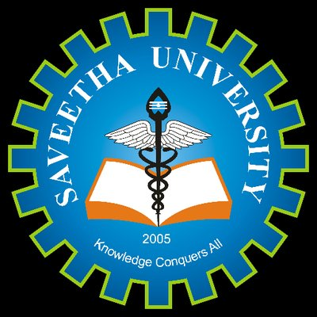
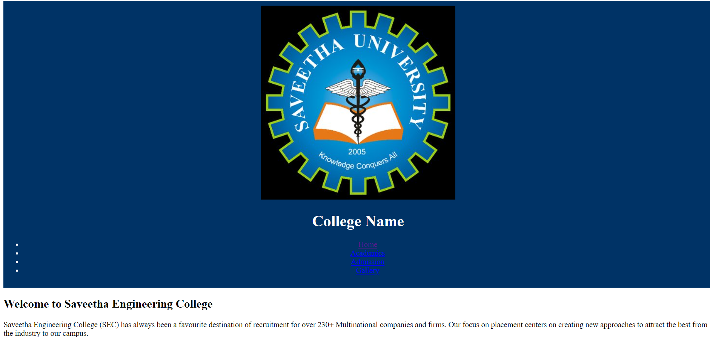

# Design a website for a College. There should be at least 15 web-pages present in the web-site.<br/>
## There should be an appropriate description of the college on the home page.<br/>
### One Academics page which contains a list of all the departments present in the college Arts, Science and Commerce. The list should be a nested list, with available courses mentioned under each department. There should be a minimum of two courses under each department, (for e.g. Computer Science and Mathematics under Science, English and Sociology under Arts  and so on). Each Course entry in the list should be a HTML link that leads to a web-page totally dedicated to the course itself.<br/>

### Each Course should have its own dedicated web-page. This page should contain a description about the course, a list of all the teachers taking the course and the timetable for that particular subject.<br/>
### The Admission page basically contains a form that a student needs to fill up in order to take admission in the college. The form should ask all the necessary questions using appropriate form elements.<br/>
### One gallery page that contains set of photos taken of the college and its students.<br/>
### Please note that each web-page in this website should have the same background Image/color. The looks of each page should be similar.<br/>

## index.html:
````
<!DOCTYPE html>
<html lang="en">
<head>
    <meta charset="UTF-8">
    <meta name="viewport" content="width=device-width, initial-scale=1.0">
    <title>College Name</title>
    <link rel="stylesheet" href="style.css">
</head>
<body>
    <header style="background-color: #003366; color: white; padding: 10px 0; text-align: center;">
        
        <h1>College Name</h1>
        <nav>
            <ul>
                <li><a href="index.html">Home</a></li>
                <li><a href="academics.html">Academics</a></li>
                <li><a href="admission.html">Admission</a></li>
                <li><a href="gallery.html">Gallery</a></li>
            </ul>
        </nav>
    </header>
    <main>
        <h2>Welcome to Saveetha Engineering College</h2>
        <p>Saveetha Engineering College (SEC) has always been a favourite destination of recruitment for over 230+ Multinational companies and firms. Our focus on placement centers on creating new approaches to attract the best from the industry to our campus.</p>
    </main>
</body>
</html>
````
## Output:

